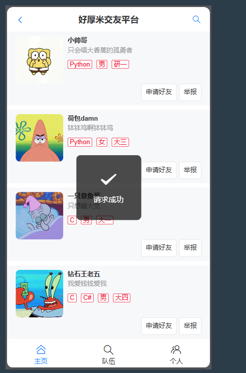
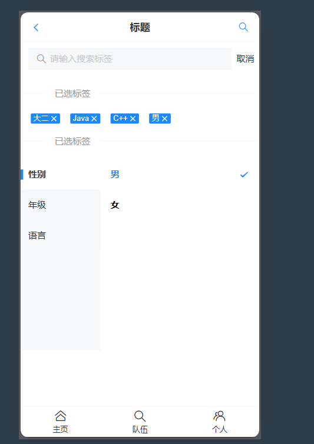
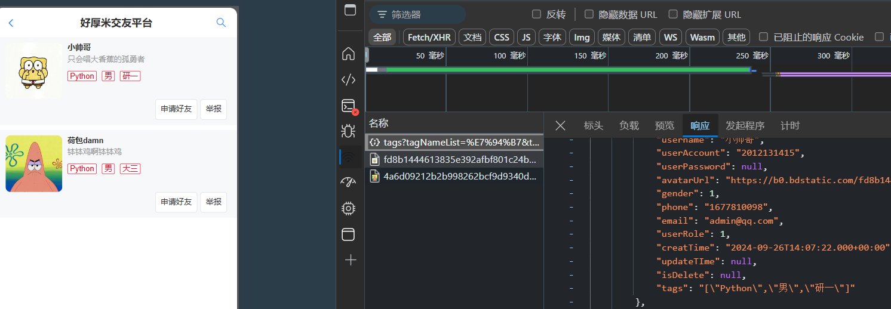
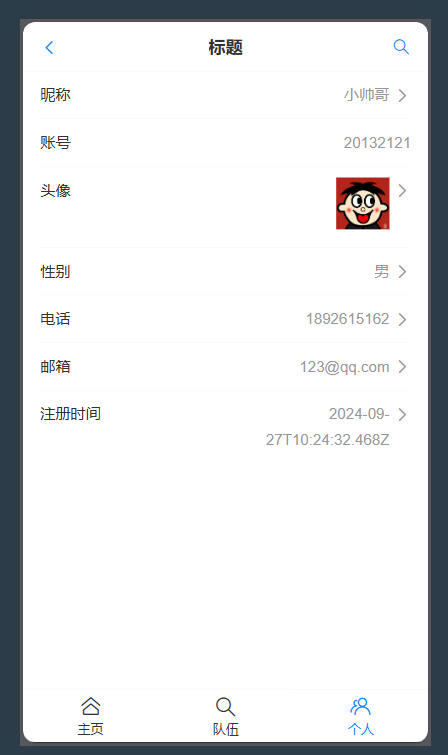
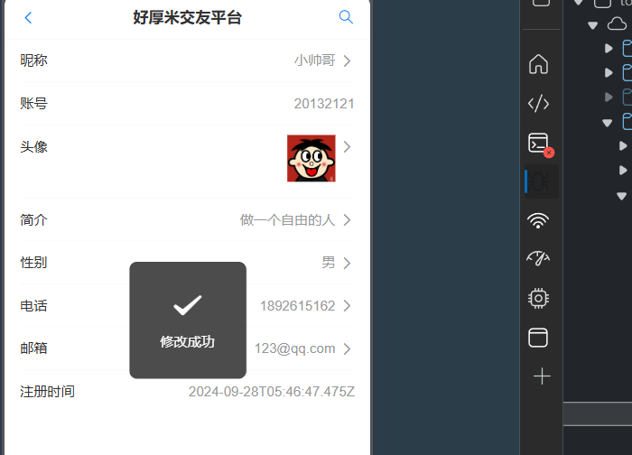

# 好厚米（交友平台）

# 项目介绍

移动端正能量的交友软件，根据个人标签信息，匹配志同道合的朋友，在普通用户管理系统的基础上增加队伍，首页推荐，标签匹配，实现用户队伍的联动。

## **主要功能**

- **登录注册**
- **主页展示用户**
- **队伍页展示队伍，加入队伍，创建队伍，退出队伍**
- **个人页展示个人信息以及修改**
- **搜索页根据标签搜索用户**

# 结果展示

## **首页**



## **搜索页**





## **个人信息页**






## 队伍页【开发中】

# 需求分析

1. 用户表中添加标签列 大一/大二 /工作   C++/JAVA/python 
2. 用户主要的操作是对个人信息的修改，以及通过标签对其他用户的查询，创建队伍，查询队伍，加入队伍实现跟用户表的联动
3. 队伍表，队伍的CRUD  
4. 首页推荐功能，像抖音，B站首页推荐一些缓存(Redis)好的用户【相似度计算】
5. 拓展。。。。。

### 前端

1. Vue 3 开发框架
2. Vant UI
3. Vite 2
4. Nginx 来单机部署

构建Vite+Vue项目  npm init vite@latest  

安装依赖

安装vant  npm i vant   

安装cant组件库  npm i unplugin-vue-components -D

### 后端

1. SpringBoot 
2. SpringMVC + MyBatis + MyBatis Plus
3. MySQL 数据库
4. Redis 缓存
5. Swagger + Knife4j 接口文档

```sql
create table houmi.user
(
    id           bigint auto_increment comment 'id' primary key ,
    username     varchar(256)                       null comment '用户昵称',
    userAccount  varchar(256)                       null comment '账号',
    userPassword varchar(512)                       not null comment '用户密码',
    gender       tinyint                            null comment '性别',
    phone        varchar(128)                       null comment '电话',
    email        varchar(512)                       null comment '邮箱',
    userRole     int      default 0                 not null comment '用户权限 0-普通用户 1-管理员',
    creatTime    datetime default CURRENT_TIMESTAMP null comment '创建时间',
    updateTIme   datetime      default CURRENT_TIMESTAMP null on update CURRENT_TIMESTAMP comment '更新时间',
    isDelete     tinyint  default 0                 null comment '逻辑删除'
)
    comment '用户表'
```

```sql
-- auto-generated definition
create table team
(
    id          bigint auto_increment comment 'id'
        primary key,
    name        varchar(256)                       not null comment '队伍名称',
    description varchar(1024)                      null comment '描述',
    maxNum      int      default 1                 not null comment '最大人数',
    expireTime  datetime                           null comment '过期时间',
    userId      bigint                             null comment '用户id',
    status      int      default 0                 not null comment '0 - 公开，1 - 私有，2 - 加密',
    password    varchar(512)                       null comment '密码',
    createTime  datetime default CURRENT_TIMESTAMP null comment '创建时间',
    updateTime  datetime default CURRENT_TIMESTAMP null on update CURRENT_TIMESTAMP,
    isDelete    tinyint  default 0                 not null comment '是否删除'
)
    comment '队伍';

```


```sql
-- auto-generated definition
create table tag
(
    id         bigint auto_increment comment 'id'
        primary key,
    tagName    varchar(256)                       null comment '标签名',
    userId     bigint                             null comment '用户id',
    parentId   bigint                             null comment '父标签id',
    isParent   tinyint                            null comment '是否为父标签 0-不是 1-是',
    createTime datetime default CURRENT_TIMESTAMP null comment '创建时间',
    updateTime datetime default CURRENT_TIMESTAMP null on update CURRENT_TIMESTAMP comment '更新时间',
    isDelete   tinyint  default 0                 null comment '逻辑删除 0-不是 1-是',
    constraint tagName__index
        unique (tagName)
)
    comment '标签表';

create index userId__index
    on tag (userId);

```


```sql
-- auto-generated definition
create table user_team
(
    id         bigint auto_increment comment 'id'
        primary key,
    userId     bigint                             null comment '用户id',
    teamId     bigint                             null comment '队伍id',
    joinTime   datetime                           null comment '加入时间',
    createTime datetime default CURRENT_TIMESTAMP null comment '创建时间',
    updateTime datetime default CURRENT_TIMESTAMP null on update CURRENT_TIMESTAMP,
    isDelete   tinyint  default 0                 not null comment '是否删除'
)
    comment '用户队伍关系';
```

# 遇到问题

1.按照vant 4文档引入导航栏但是缩在一块

main.ts是前端项目入口，挂载App.vue,在App.vue中引入写好的导航栏命名为NavBar