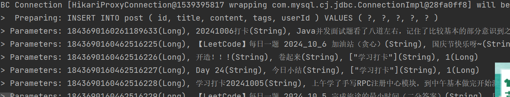
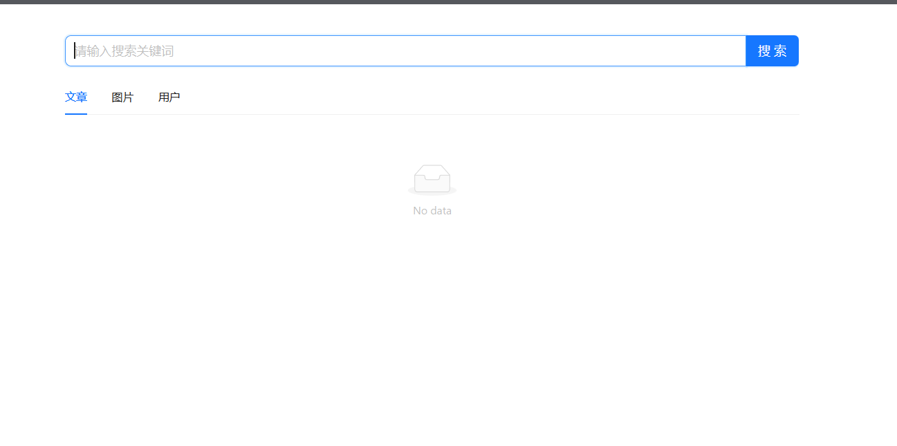
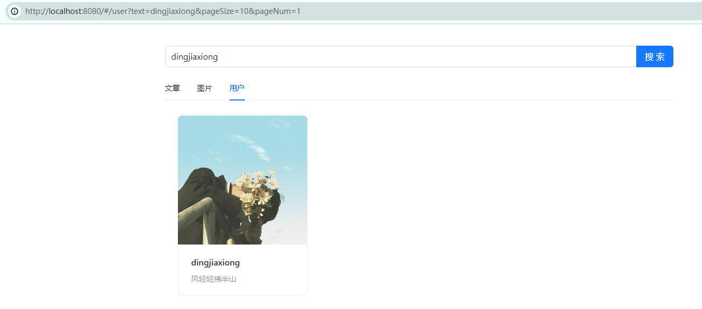
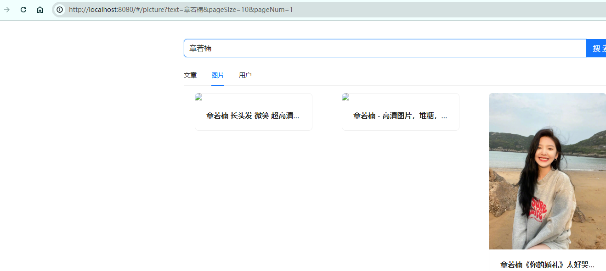

# 搜啰(搜索中台)

# 项目介绍

用户在同一个页面能搜索到不同来源不同类型的内容。类似网站或者b站的搜索


# 主要功能

1. **得到各种不同分类的数据**
2. **呈现一个搜索页面**
3. **搜索页面提供不同的API从不同数据库中得到不同的信息**

# 结果展示

## 获取网页数据（调用接口）

```java
 String json = "{\n" +
                "    \"pageSize\": 12,\n" +
                "    \"sortOrder\": \"descend\",\n" +
                "    \"sortField\": \"createTime\",\n" +
                "    \"tags\": [],\n" +
                "    \"current\": 3,\n" +
                "    \"reviewStatus\": 1,\n" +
                "    \"category\": \"文章\",\n" +
                "    \"hiddenContent\": true\n" +
                "}";

        String url = "https://api.code-nav.cn/api/post/list/page/vo";
        String result = HttpRequest
                .post(url)
                .body(json)
                .execute()
                .body();
//        System.out.println(result);
```



## 从页面HTML文档得到数据

```java
void testFetchPicture() throws IOException {
        int current = 1;
        String url = "https://cn.bing.com/images/search?q=小黑子&first=" + current;
        Document doc = Jsoup.connect(url).get();
        Elements elements = doc.select(".iuscp.isv");
        List<Picture> pictures = new ArrayList<>();
        for (Element element : elements) {
            // 取图片地址（murl）
            String m = element.select(".iusc").get(0).attr("m");
            Map<String, Object> map = JSONUtil.toBean(m, Map.class);
            String murl = (String) map.get("murl");
//            System.out.println(murl);
            // 取标题
            String title = element.select(".inflnk").get(0).attr("aria-label");
//            System.out.println(title);
            Picture picture = new Picture();
            picture.setTitle(title);
            picture.setUrl(murl);
            pictures.add(picture);
        }
        System.out.println(pictures);
    }
```


## 页面



## 用户



## 文章


## 图片



