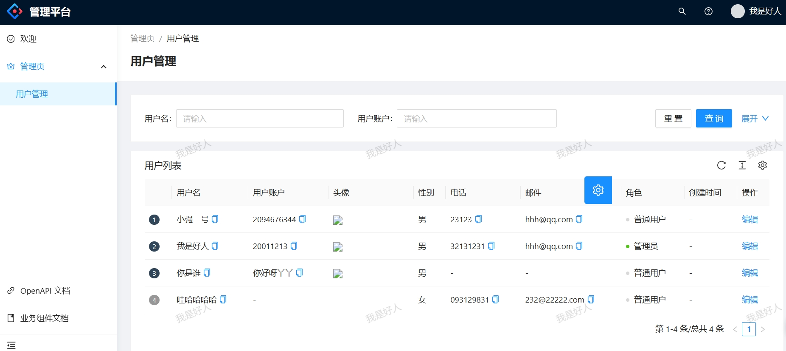
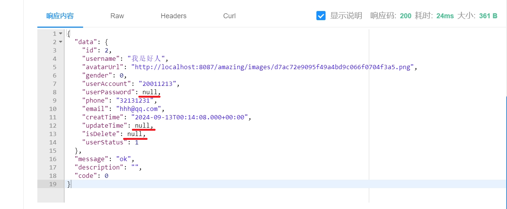
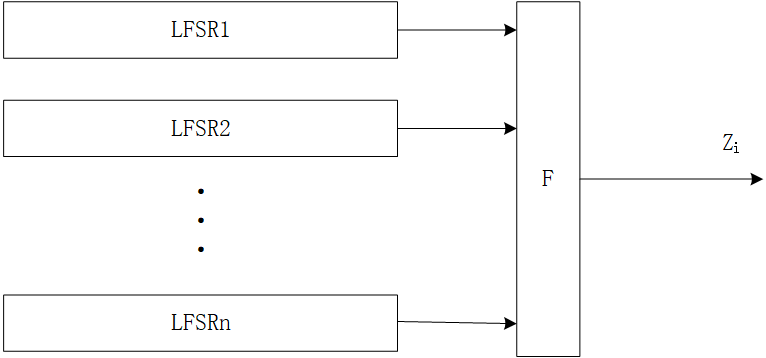
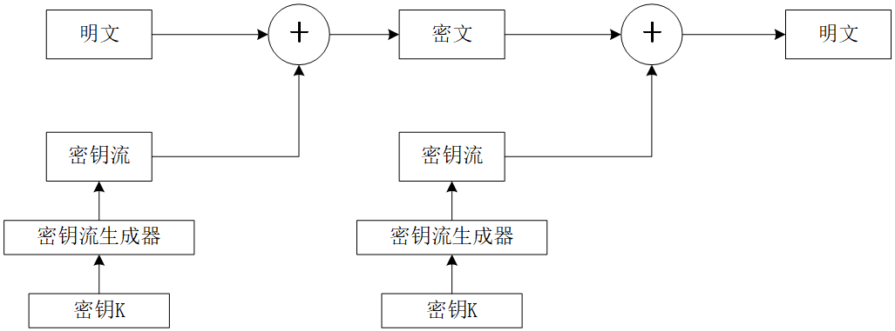

# 工作汇报

# 主要任务

1. 项目
2. 图解密码学
3. 英语学习

## 项目

### 用户中心

简单的一个用户管理系统，基于用户与管理员两种身份，实现了用户的注册登录，以及管理员对用户的增删改查功能



### 交友平台

在用户管理的基础上增加组队功能，首页推荐，标签搜索匹配


### 搜索中台

用户在同一个页面能搜索到不同来源不同类型的内容。类似网站或者b站的搜索


### 安全性保密性

1. 数据库中存储用户密码的密文

   ```java
   /*
    * MD5，一种常用的哈希函数，用于将任意长度的数据转换为一个128位的哈希值
      容易遭受碰撞攻击【相同密码得到的哈希值相同】和彩虹表攻击【几乎标记了所有字符串的MD5对照表】
    */
   //盐值＋原始密码拼接再哈希
   //相同的密码得到的哈希值也会不一样
   String encryptPassword= DigestUtils.md5DigestAsHex((SALT+userPassword).getBytes());
   ```

2. 返回前端涉及用户敏感信息要去除

   

3. 保证接口安全

   - 不是什么人都能调用【鉴权】
   - 流量控制【防止系统短时间接收过多的请求或事件，从而导致系统过载或者崩溃】

## 图解密码学

加密方法

1. 单钥密码体制
   - 流密码【第二章】
   - 分组密码【第三章】
2. 公钥密码体制【第四章】

密钥分配与管理【第五章】

哈希【第六章】

数字签名和认证协议【第七章】

密码协议【第八章】

可证明安全【第九章】

- 刻画公钥密码体制的语义安全性

网络认证与加密【第十章】

- 加密认证技术在网络中的应用

区块链【第十一章】

- 区块链中的密码技术


第一章【基本概念】

凯撒密码加密

- 对字母加密，ASCII码的移位对应字母变化

仿射变换加密


流密码【序列加密，属于对称加密】

密钥流生成器



1. 驱动部分
   - 控制生成器的状态转移
   - 提供统计性能好的序列
2. 非线性组合部分
   - 组合出满足要求的密钥流

明文数据每次与密钥数据流顺次对应加密，得到密文数据流



RC4加密

1. 初始化状态向量数组S，指定一个短密钥存储在key数组中
2. 利用密钥数组key对状态数组S中的数重新排列
3. 利用重新排列的数组S产生于明文长度相同的密钥流
4. 一个明文字节与一个密钥的字节进行异或生成一个密文的字节
